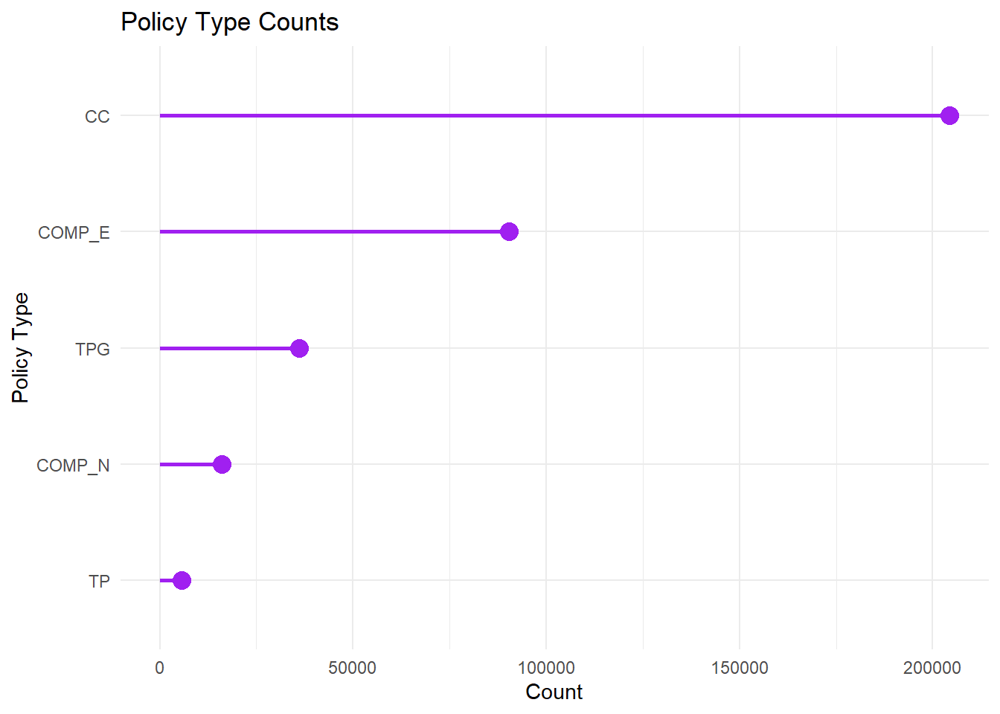
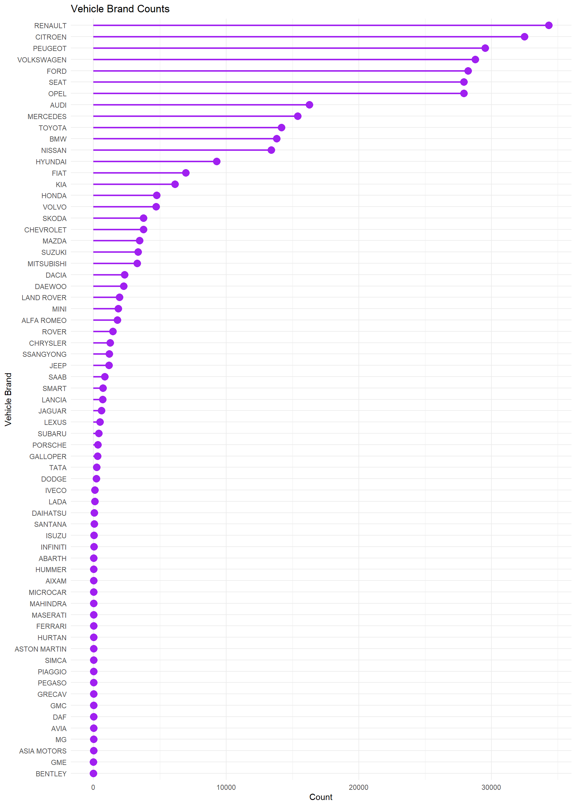
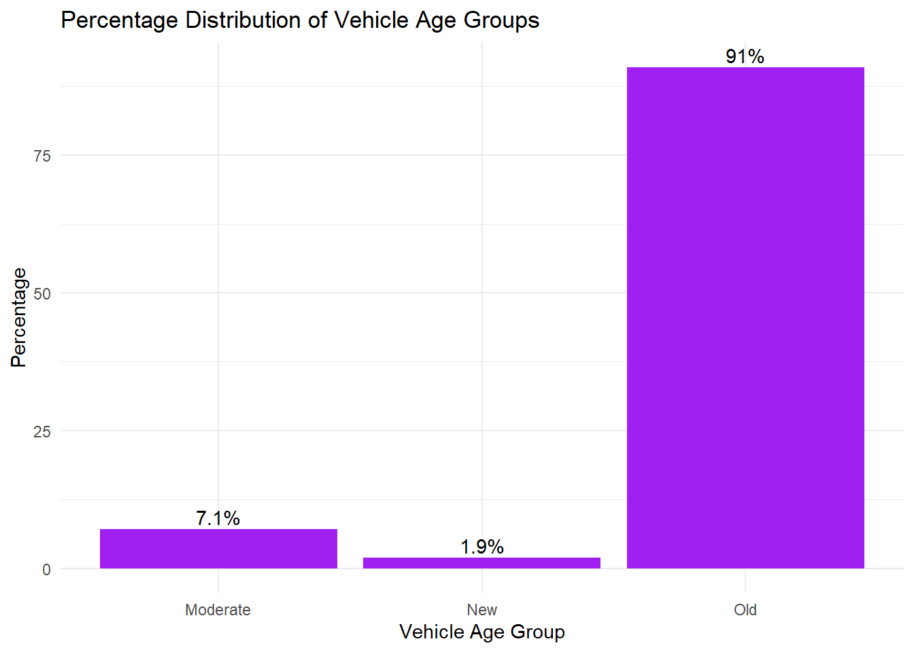
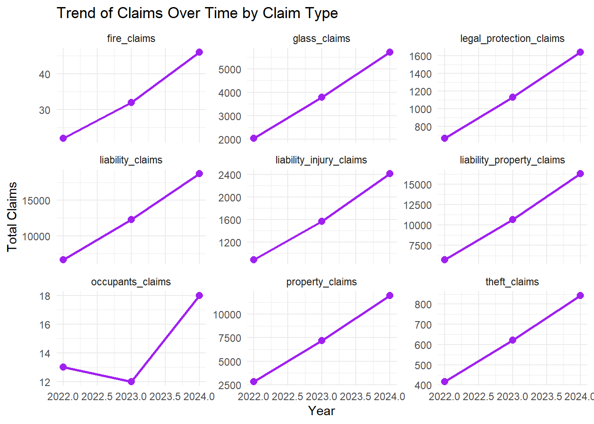
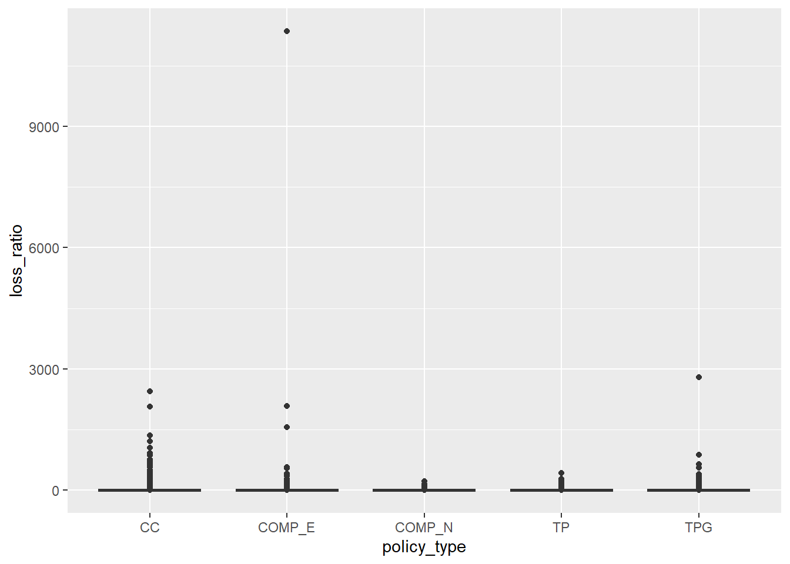
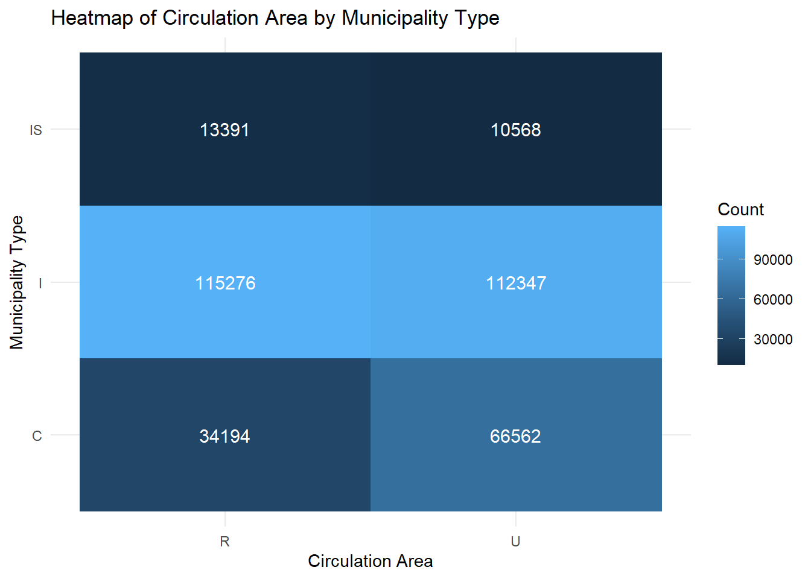
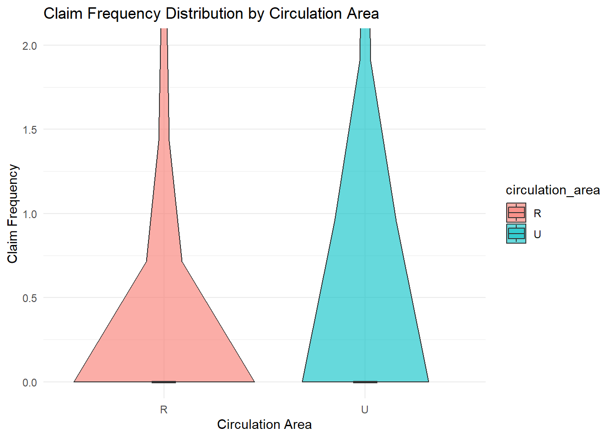
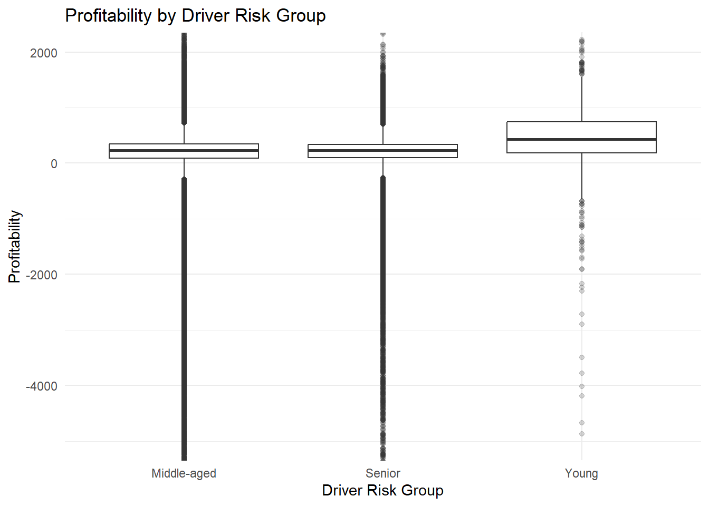
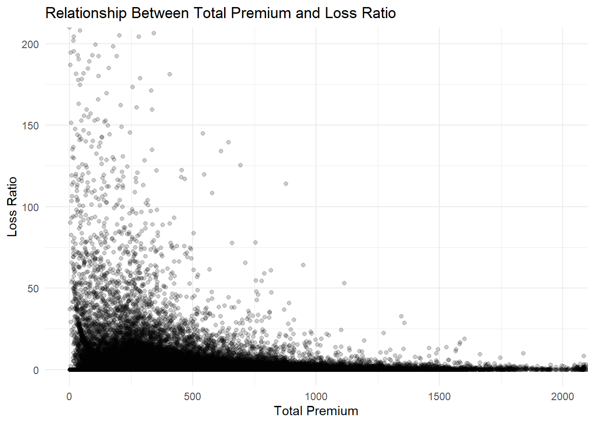

## Contents

-   Feature engineering
-   Univariate analysis
-   Bivariate analysis
-   Insights & conclusion

## Feature engineering (new variables)

-   Profitability = total_premium - total_incurred
-   Loss ratio = total_incurred/total_premium
-   Claim flag. If total_incurred \>0, means claim has been made.
-   Claim severity
-   Claims per exposure = total_incurred / total_exposure
-   Driver risk group.Taking age into consideration
-   driving_experience = driver_age - age_driving_licence
-   Vehicle age group. Grouping based on age of vehicle.
-   claim_frequency = total_claims / total_exposure

## Univariate: Policy type counts

{width="75%"}

[View full analysis in report](Take_Home_1.html#counts-of-each-policy-type)

::: notes
CC is the policy type with the largest number, at 200,000 policies. It exceeds all others. TP has the fewest with fewer than 10,000 records. TP provides basic coverage, however CC offers more coverage. Customers strongly prefer comprehensive coverage over basic plans. 
:::

## Univariate: Vehicle brand counts

::: {style="height:400px; overflow:hidden;"}
{width="75%"}
:::

[View full analysis in report](Take_Home_1.html#counts-of-vehicle-brands)

::: notes
Few major brands make up the majority of the portfolio. Renault has the largest at approximately 34,000, followed by Citroen and Peugeot at 29,000 each. Most top brands are mass market European manufacturers. This insurer has customers who are mainly mainstream vehicle owners, rather than high end brands.
  
:::

## Univariate: Vehicle age percentage distribution

{width="75%"}

[View full analysis in report](Take_Home_1.html#percentage-distribution-of-each-vehicle-age-group)

::: notes
Old vehicles make up a large portion of this portfolio, 91% of all insured vehicles. This indicates that the insurer mainly covers older vehicles rather than newly purchased vehicles. Older vehicles have very unique traits and portray different risk characteristics.  
:::

## Bivariate: Trend of all claims by claim type

{width="75%"}

[View full analysis in report](Take_Home_1.html#trend-of-total-claims-over-time)

::: notes
Most claim categories increased from 2022 to 2024. Liability claims recorded the highest volume increase from 7000 to over 18000. Liability property claims also grew sharply, increasing from around 6000 to more than 16000 claims. Property claims increased from about 3000 in 2022 to over 12000 in 2024. Occupant claims remained low with slight dip to 12 in 2023. Overall, the upward trend suggests increasing insurer exposure and possibly higher overall claims costs over time. 
:::

## Bivariate: Distribution of loss ratio by policy type

{width="75%"}

[View full analysis in report](Take_Home_1.html#distribution-of-loss-ratio-by-policy-type)

::: notes
Loss ratios are highly skewed across all policy types, with most observations concentrated near 0. There are some outliers. COMP-E has the most extreme outlier with loss ratio exceeding 10,000 far higher than the rest. CC and TPG also contain outliers, with some exceeding 2000. While most policies remain profitable or low-loss , a small number of claims generate extremely large losses. High loss events are rare but have significant impact.  
:::

## Bivariate: Heatmap of circulation area by municipality type

{width="75%"}

[View full analysis in report](Take_Home_1.html#heatmap-of-circulation-area-by-municiality-type)

::: notes
Type I municipality has the highest concentration of policies in both rural and urban areas, with roughly 115,000 rural and 112,000 in urban areas. Municipality type I dominates the portfolio. Municipality type C has more records in urban at 66,000 compared to rural which has only 34,000 records. Overall IS municaplity type has lower counts overall. 

:::

## Bivariate: Claim frequency distribution

{width="75%"}

[View full analysis in report](Take_Home_1.html#claim-frequency-distribution-by-circulation-area)

::: notes
The distribution for both circulation areas are very similar. For both, most policies are concentrated near very low claim frequency values. The right skewed distribution shows that most policyholders make few to 0 claims. This indicates that circulation area alone may not be sufficient in explaining the differences in claim frequency. Other factors may have greater influence on claims behaviour.
:::

## Bivariate: Profitability by driver risk group

{width="75%"}

[View full analysis in report](Take_Home_1.html#profitability-by-driver-risk-group)

::: notes
Young drivers show the highest median profitability compared to other groups. It has larger interquartile range, indicating greater variability in outcomes. Middle-aged and senior drivers have similar median profitability levels, but both groups contain many extreme negative outliers, with losses extending below -5,000. Young drivers also have negative outliers, though fewer observations reach the most severe losses. Though all groups have extreme outliers, most policies still remain profitable, as the median is above 0. Driver risk group affects profitability distribution, young drivers appear more profitable.
:::

## Bivariate: Relationship between total premium and loss ratio

{width="75%"}

[View full analysis in report](Take_Home_1.html#relationship-between-total-premium-and-loss-ratio)

::: notes
The scatterplot shows an inverse relationship between total premium and loss ratio. Policies with lower premiums, below 500, display the highest variability and contain many extreme loss ratios exceeding 200. As premiums increase beyond 1000, the loss ratio are nearer to 0, with significantly fewer extreme outliers. This shows that lower premium policies are more volatile and prone to huge loss, while higher premium policies are more stable and predictable. 
:::

## Insights & Conclusion

- portfolio is heavily concentrated in CC policies, old vehicles and European car brands. 

- claims activity increased from 2022 to 2024. 

- circulation area alone is not sufficient to predict claims behaviour

- Most policies are low loss, small number of claims drive huge losses

- lower premium policies are much more volatile

